# Plano da Integracao

Atualizado em: 2026-06-03.

## Objetivo

Criar uma integracao para buscar pedidos, preparar os dados logisticos e gerar pedidos de coleta na transportadora. O Virtual Age/TOTVS Moda entra como uma das pontas principais da integracao, inicialmente pela API V2 de Sales Order.

## Fluxo previsto

```mermaid
flowchart LR
    A["Buscar pedidos no Virtual Age/TOTVS Moda"] --> B["Filtrar pedidos aptos para coleta"]
    B --> C["Normalizar cliente, endereco, itens, peso, volume e servico"]
    C --> D["Validar dados obrigatorios da transportadora"]
    D --> E["Dry-run operacional ou criar pedido na transportadora"]
    E --> F["Salvar vinculo pedido x coleta"]
    F --> G["Registrar resumo, erros, eventos e pendencias"]
    G --> H["Reprocessar/corrigir pedidos especificos quando necessario"]
    H --> I["Atualizar observacao/status/logistico quando aplicavel"]
```

## Requisitos funcionais

- Autenticar no Virtual Age/TOTVS Moda com token Bearer.
- Enviar `x-api-key` quando o acesso for pelo Hub TOTVS Moda/API Gateway.
- Consultar uma vez por dia, as 17:00, apenas os pedidos faturados no proprio dia entre `00:00:00` e `17:00:00`, respeitando o fechamento do CD, que ocorre por volta das 16:30.
- Filtrar por empresa/filial, situacao do pedido, transportadora e dados logisticos.
- Consultar itens pendentes quando a coleta depender do saldo ainda nao atendido.
- Montar um payload normalizado para a transportadora.
- Criar pedido de coleta na transportadora.
- Registrar a relacao entre pedido Virtual Age e coleta criada.
- Impedir duplicidade de coleta para o mesmo pedido.
- Registrar erros, tentativas, payloads relevantes e resposta da transportadora.
- Rodar em modo dry-run operacional sem chamar a J&T.
- Limitar envios reais por execucao durante piloto.
- Consultar resumo operacional de execucoes, coletas e erros.
- Monitorar pendencias operacionais por pedido.
- Reprocessar pedidos especificos com fila, dry-run e envio real controlado.
- Registrar overrides/correcoes manuais de forma auditada.

## Requisitos nao funcionais

- Segredos devem ficar fora do Git, preferencialmente em variaveis de ambiente ou cofre.
- Logs nao devem expor CPF, CNPJ, telefone, endereco completo ou token sem mascaramento.
- Toda chamada externa deve ter timeout, retry controlado e tratamento de erro.
- A integracao precisa ser idempotente: repetir uma execucao nao deve criar coleta duplicada.
- As consultas devem usar paginacao e limite de janela para evitar carga excessiva.
- Erros de dados devem ir para uma fila/lista de pendencias para correcao operacional.

## Dados de configuracao necessarios

### Virtual Age/TOTVS Moda

- URL base do ambiente.
- `x-api-key`, quando usado Hub/API Gateway.
- `client_id` e `client_secret`.
- `username` e `password`, caso o grant usado seja `password`.
- `branch` ou lista de empresas/filiais autorizadas.
- Situacoes de pedido que entram na integracao.
- Regra para identificar pedidos prontos para coleta.
- Codigo ou CNPJ da transportadora cadastrada no Virtual Age, se o filtro depender disso.

### Transportadora

- URL base do ambiente de teste e producao da J&T Open Platform.
- Credenciais: `apiAccount`, `privateKey`, `customerCode` e senha do cliente.
- Endpoint para criar pedido/coleta: `POST /order/addOrder`.
- Endpoint para consultar pedido: `POST /order/getOrders`.
- Endpoint para cancelar pedido/coleta: `POST /order/cancelOrder`.
- Endpoint para etiqueta: `POST /order/printOrder`.
- Regras de volume, peso, cubagem, dimensoes, tipo de servico e tipo fiscal.
- URLs publicas para receber callbacks de status, rastreio e peso.

## Dados minimos esperados para criar uma coleta

- Identificador do pedido: `orderId` ou par `branchCode` + `orderCode`.
- Cliente/destinatario: nome, CPF/CNPJ quando necessario.
- Endereco de coleta/entrega: CEP, logradouro, numero, bairro, cidade e UF.
- Itens ou resumo dos volumes: quantidade, peso, volumes, valor declarado quando exigido.
- Servico de transporte: tipo de frete, modalidade, prazo ou codigo do servico.
- Janela ou data desejada de coleta, se a transportadora exigir.
- Remetente/origem, se nao for fixo por contrato.
- Credenciais J&T e assinaturas `digest` calculadas corretamente.

## Modelo de persistencia implementado

A integracao ja possui adapters em memoria e Postgres para:

- `sync_runs`: execucoes de busca, janela consultada, status, paginas lidas e metricas.
- `orders`: pedidos vistos, status interno, dados principais e ultima atualizacao.
- `pickup_requests`: relacao entre pedido e coleta, `txlogisticId`, `billCode`, status e resposta.
- `integration_errors`: erros de validacao, autenticacao, timeout e divergencias de dados com contexto sanitizado.
- `execution_locks`: trava de execucao por janela para evitar concorrencia do lote.
- `operational_issues`: pendencias abertas/resolvidas por pedido.
- `order_processing_events`: linha do tempo operacional por pedido.
- `order_overrides`: correcoes temporarias auditadas para reprocessamento.
- `reprocess_requests`: fila de reprocessamento de pedidos especificos.
- `reprocess_attempts`: historico das tentativas de reprocessamento.

## Perguntas pendentes

- A fonte dos pedidos sera sempre o Virtual Age ou outro sistema tambem vai alimentar a fila?
- Quais credenciais/ambiente da J&T serao usados em homologacao e producao?
- Qual status do Virtual Age significa "pronto para coleta"?
- Devemos atualizar algo no Virtual Age apos criar a coleta, como observacao, transportadora, servico ou status?
- A coleta sera por pedido individual ou pode agrupar varios pedidos por endereco/remetente?
- Como tratar pedidos parcialmente atendidos ou com itens pendentes?
- Quais empresas/filiais entram no escopo inicial?
- Vamos receber callbacks da J&T ou consultar rastreio/peso por polling?
- A interface operacional propria sera apenas painel de consulta ou tambem executara override e reprocessamento?
- Quem pode aprovar override e envio real de reprocessamento?
